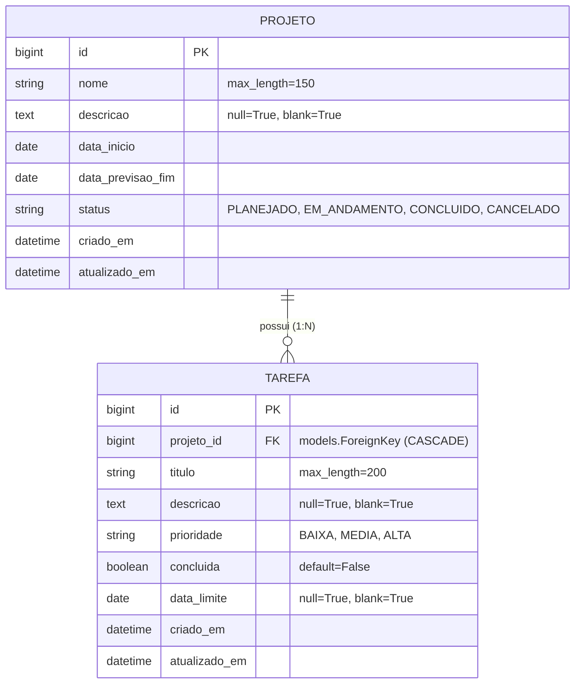

# API RESTful de Gestão de Projetos e Tarefas (To-Do List API)

Projeto desenvolvido com **Django** e **Django REST Framework (DRF)** para a disciplina de **Tópicos de Software / Desenvolvimento de API RESTful**.

A aplicação consiste em uma API robusta para gerenciamento de projetos e suas respectivas tarefas, implementando o ciclo de vida completo (CRUD), relacionamentos 1:N no ORM, serialização aninhada (*nested serializers*), filtros dinâmicos, paginação e controle de variáveis de ambiente.

---

## 🛠️ Tecnologias Utilizadas

* **Linguagem:** Python 3.10+
* **Framework Web:** Django 5.x
* **Framework REST:** Django REST Framework (DRF)
* **Filtros:** `django-filter`
* **Variáveis de Ambiente:** `python-dotenv`
* **Banco de Dados:** SQLite (Desenvolvimento / Padrão)

---

## 🗄️ Modelagem de Dados e Relacionamento

O sistema modela duas entidades principais com relacionamento explícito **1:N (Um para Muitos)**: um **Projeto** pode conter múltiplas **Tarefas**, e cada **Tarefa** pertence obrigatoriamente a um **Projeto**.



### Detalhes das Entidades

1. **`Projeto`**:
   * `id`: Chave primária autoincrementada.
   * `nome`: Nome identificador do projeto (`CharField`, max: 150).
   * `descricao`: Detalhes sobre o escopo do projeto (`TextField`, opcional).
   * `data_inicio`: Data oficial de início (`DateField`).
   * `data_previsao_fim`: Previsão de encerramento (`DateField`).
   * `status`: Estado atual (`PLANEJADO`, `EM_ANDAMENTO`, `CONCLUIDO`, `CANCELADO`).
   * `criado_em`: Timestamp automático de criação.
   * `atualizado_em`: Timestamp automático de atualização.

2. **`Tarefa`**:
   * `id`: Chave primária autoincrementada.
   * `projeto`: Chave estrangeira referenciando `Projeto` (`on_delete=models.CASCADE`, `related_name='tarefas'`).
   * `titulo`: Título sucinto da atividade (`CharField`, max: 200).
   * `descricao`: Descrição técnica da tarefa (`TextField`, opcional).
   * `prioridade`: Nível de urgência (`BAIXA`, `MEDIA`, `ALTA`).
   * `concluida`: Flag booleana indicando status de conclusão (`BooleanField`).
   * `data_limite`: Prazo final de entrega da tarefa (`DateField`, opcional).
   * `criado_em`: Timestamp automático de criação.
   * `atualizado_em`: Timestamp automático de atualização.

---

## 📡 Endpoints e Métodos HTTP

Todos os verbos HTTP semânticos foram contemplados respeitando as boas práticas RESTful:

| Método | Endpoint | Descrição | Status de Sucesso | Status de Erro |
| :--- | :--- | :--- | :--- | :--- |
| `GET` | `/api/projetos/` | Listagem paginada de projetos com suporte a filtros e busca | `200 OK` | `500 Internal Server Error` |
| `POST` | `/api/projetos/` | Cadastro de um novo projeto | `201 Created` | `400 Bad Request` |
| `GET` | `/api/projetos/<id>/` | Consulta detalhada do projeto exibindo **tarefas aninhadas** | `200 OK` | `404 Not Found` |
| `PUT` | `/api/projetos/<id>/` | Atualização integral de todos os campos do projeto | `200 OK` | `400 Bad Request`, `404 Not Found` |
| `PATCH` | `/api/projetos/<id>/` | Atualização parcial de campos específicos do projeto | `200 OK` | `400 Bad Request`, `404 Not Found` |
| `DELETE`| `/api/projetos/<id>/` | Remoção do projeto e suas tarefas associadas | `204 No Content`| `404 Not Found` |
| `GET` | `/api/tarefas/` | Listagem paginada de tarefas com filtros por status/prioridade | `200 OK` | `500 Internal Server Error` |
| `POST` | `/api/tarefas/` | Criação de uma tarefa vinculada a um projeto existente | `201 Created` | `400 Bad Request` |
| `GET` | `/api/tarefas/<id>/` | Detalhes de uma tarefa específica | `200 OK` | `404 Not Found` |
| `PUT` | `/api/tarefas/<id>/` | Atualização integral da tarefa | `200 OK` | `400 Bad Request`, `404 Not Found` |
| `PATCH` | `/api/tarefas/<id>/` | Atualização parcial da tarefa | `200 OK` | `400 Bad Request`, `404 Not Found` |
| `DELETE`| `/api/tarefas/<id>/` | Remoção da tarefa | `204 No Content`| `404 Not Found` |

---

## 👥 Divisão de Trabalho da Equipe (5 Desenvolvedores)

A implementação foi estruturada modularmente para que cada desenvolvedor assuma a responsabilidade por uma camada técnica da aplicação, garantindo total domínio durante a arguição técnica individual:

```
┌────────────────────────────────────────────────────────────────────────┐
│                          DIVISÃO DE FUNÇÕES                            │
├───────────────┬────────────────────────────────────────────────────────┤
│ Desenvolvedor │ Camada de Responsabilidade Técnica                    │
├───────────────┼────────────────────────────────────────────────────────┤
│ Dev 1         │ Infraestrutura, Variáveis de Ambiente e Configuração   │
│ Dev 2         │ Modelagem de Dados ORM, Relacionamentos e Migrações    │
│ Dev 3         │ Serializadores, Validações e Serialização Aninhada     │
│ Dev 4         │ Controladores (ViewSets), Rotas e Métodos HTTP         │
│ Dev 5         │ Filtros, Paginação, Testes e Documentação              │
└───────────────┴────────────────────────────────────────────────────────┘
```

---

### 👨‍💻 Dev 1: Infraestrutura, Variáveis de Ambiente e Configuração Base
* **Escopo de Atuação:**
  * Criação e configuração inicial do projeto Django e do aplicativo modular (`tasks` ou `core`).
  * Isolamento de credenciais e parâmetros sensíveis (`SECRET_KEY`, `DEBUG`, configurações de banco) através do `.env` com a biblioteca `python-dotenv`.
  * Criação do arquivo de exemplo `.env.example`.
  * Configuração do `settings.py`:
    * Registro dos apps (`rest_framework`, `django_filters`, `tasks`).
    * Configuração de fuso horário (`TIME_ZONE = 'America/Sao_Paulo'`).
    * Configuração global do DRF (`DEFAULT_PAGINATION_CLASS`, `PAGE_SIZE`, `DEFAULT_FILTER_BACKENDS`).
  * Estruturação e manutenção do arquivo `requirements.txt`.
* **Tópicos para a Arguição / Defesa Técnica:**
  * Boas práticas de segurança em projetos Django (não expor chaves no Git).
  * Como o Django carrega configurações a partir de arquivos `.env`.
  * Estrutura e ciclo de inicialização do `settings.py`.

---

### 👨‍💻 Dev 2: Modelagem de Dados ORM, Relacionamentos e Migrações
* **Escopo de Atuação:**
  * Implementação das classes `Projeto` e `Tarefa` no arquivo `models.py`.
  * Configuração do relacionamento 1:N através de `models.ForeignKey(Projeto, on_delete=models.CASCADE, related_name='tarefas')`.
  * Definição de escolhas tipadas (`choices`) para `status` e `prioridade`.
  * Gestão de schema do banco através dos comandos `makemigrations` e `migrate`.
  * Registro e personalização das tabelas no painel administrativo (`admin.py`), configurando colunas de exibição (`list_display`), filtros laterais (`list_filter`) e campos de busca (`search_fields`).
* **Tópicos para a Arguição / Defesa Técnica:**
  * Funcionamento do mapeamento objeto-relacional (ORM) do Django.
  * O papel do parâmetro `related_name` em consultas reversas.
  * Comportamento da integridade referencial com `models.CASCADE`.
  * Como o sistema de migrações rastreia alterações estruturais no banco de dados.

---

### 👨‍💻 Dev 3: Serializadores, Validações e Serialização Aninhada
* **Escopo de Atuação:**
  * Implementação dos serializadores no arquivo `serializers.py` herdando de `serializers.ModelSerializer`.
  * Construção do `TarefaSerializer` para operações normais de Tarefa.
  * Construção do `ProjetoListSerializer` para listagens otimizadas.
  * Construção do `ProjetoDetailSerializer` implementando **Serialização Aninhada** (`tarefas = TarefaSerializer(many=True, read_only=True)`) para exibir as tarefas dentro do projeto.
  * Implementação de regras de validação personalizadas no DRF:
    * `validate()` em `Projeto`: assegurar que `data_previsao_fim >= data_inicio`.
    * `validate()` em `Tarefa`: assegurar que a `data_limite` da tarefa não ultrapasse os limites de datas do projeto associado.
* **Tópicos para a Arguição / Defesa Técnica:**
  * Ciclo de vida da serialização (conversão Model -> Python Dict -> JSON) e desserialização (JSON -> Python Dict -> Model).
  * Como funcionam os métodos `validate_<campo>()` e `validate()`.
  * Prevenção de loops infinitos em serializadores aninhados (*nested serializers*).

---

### 👨‍💻 Dev 4: Controladores (ViewSets), Rotas e Métodos HTTP
* **Escopo de Atuação:**
  * Criação dos controladores `ProjetoViewSet` e `TarefaViewSet` no arquivo `views.py` utilizando `rest_framework.viewsets.ModelViewSet`.
  * Implementação dinâmica de serializers via método `get_serializer_class`:
    * Retornar `ProjetoDetailSerializer` para a ação `retrieve` (`GET /api/projetos/<id>/`).
    * Retornar `ProjetoListSerializer` para a ação `list` (`GET /api/projetos/`).
  * Configuração do roteamento automático no `urls.py` utilizando `rest_framework.routers.DefaultRouter`.
  * Garantia de conformidade com todos os métodos HTTP (`GET`, `POST`, `PUT`, `PATCH`, `DELETE`) e seus respectivos códigos de status HTTP (`200`, `201`, `204`, `400`, `404`, `500`).
* **Tópicos para a Arguição / Defesa Técnica:**
  * Diferenças entre `APIView`, `GenericAPIView` e `ModelViewSet`.
  * Mapeamento interno das actions (`list`, `create`, `retrieve`, `update`, `partial_update`, `destroy`) para os verbos HTTP.
  * Como o `DefaultRouter` registra rotas e parâmetros de URL automaticamente.

---

### 👨‍💻 Dev 5: Filtros, Paginação, Testes e Documentação
* **Escopo de Atuação:**
  * Configuração e ativação dos filtros com `django-filter`, `SearchFilter` e `OrderingFilter` nas ViewSets:
    * `ProjetoViewSet`: filtro por `status`, busca por `nome` (`search=...`) e ordenação por `data_inicio`.
    * `TarefaViewSet`: filtro por `prioridade`, `concluida`, `projeto` e busca por `titulo`.
  * Implementação da paginação nativa (`PageNumberPagination` com limite configurado por página).
  * Criação de suíte de testes automatizados (`tests.py`) ou arquivo de requisições HTTP (`requests.http` / Postman Collection) validando o fluxo completo de CRUD.
  * Redação do manual de execução, exemplos de payloads e documentação no `README.md`.
* **Tópicos para a Arguição / Defesa Técnica:**
  * Como o DRF intercepta parâmetros de consulta (*query parameters*) para aplicar filtros no QuerySet.
  * Estrutura de resposta envelopada da paginação (`count`, `next`, `previous`, `results`).
  * Metodologia de testes de endpoints REST e validação de contratos de payload.

---

## 🔒 Regras de Negócio e Validações

1. **Validação de Cronograma do Projeto:**
   * A data de previsão de término (`data_previsao_fim`) deve ser estritamente igual ou posterior à data de início (`data_inicio`). Caso contrário, a API rejeita com status `400 Bad Request`.
2. **Validação de Prazo da Tarefa:**
   * A `data_limite` de uma tarefa deve respeitar o intervalo de datas do projeto ao qual ela pertence.
3. **Integridade Referencial:**
   * A exclusão de um projeto acarreta a exclusão em cascata (`CASCADE`) de suas tarefas associadas, mantendo a consistência do banco de dados relacional.

---

## 🚀 Guia de Instalação e Execução

Siga os passos abaixo para configurar e executar o projeto localmente:

### 1. Clonar o Repositório e Acessar a Pasta
```bash
git clone <URL_DO_REPOSITORIO>
cd to_do_list
```

### 2. Criar e Ativar o Ambiente Virtual
* **No Windows (PowerShell):**
  ```powershell
  python -m venv .venv
  .\.venv\Scripts\Activate.ps1
  ```
* **No Linux/macOS:**
  ```bash
  python3 -m venv .venv
  source .venv/bin/activate
  ```

### 3. Instalar as Dependências
```bash
pip install -r requirements.txt
```

### 4. Configurar as Variáveis de Ambiente
Copie o arquivo de exemplo e crie o `.env`:
```bash
cp .env.example .env
```
*Edite o arquivo `.env` para ajustar a `SECRET_KEY` e o modo `DEBUG` conforme necessário.*

### 5. Executar as Migrações do Banco de Dados
```bash
python manage.py makemigrations
python manage.py migrate
```

### 6. Criar um Superusuário (Opcional - Para acessar o Django Admin)
```bash
python manage.py createsuperuser
```

### 7. Iniciar o Servidor de Desenvolvimento
```bash
python manage.py runserver
```
A API estará acessível em: `http://127.0.0.1:8000/api/`

---

## 📦 Exemplos de Uso dos Endpoints (Payloads JSON)

### 1. Criar Projeto (`POST /api/projetos/`)
**Payload de Envio:**
```json
{
  "nome": "Redesenho do Portal Institucional",
  "descricao": "Modernização da interface e arquitetura do portal corporativo.",
  "data_inicio": "2026-10-01",
  "data_previsao_fim": "2026-12-15",
  "status": "PLANEJADO"
}
```
**Resposta (`201 Created`):**
```json
{
  "id": 1,
  "nome": "Redesenho do Portal Institucional",
  "descricao": "Modernização da interface e arquitetura do portal corporativo.",
  "data_inicio": "2026-10-01",
  "data_previsao_fim": "2026-12-15",
  "status": "PLANEJADO",
  "criado_em": "2026-09-24T21:00:00Z",
  "atualizado_em": "2026-09-24T21:00:00Z"
}
```

---

### 2. Criar Tarefa Associada (`POST /api/tarefas/`)
**Payload de Envio:**
```json
{
  "projeto": 1,
  "titulo": "Desenhar wireframes no Figma",
  "descricao": "Criar os protótipos de alta fidelidade das telas principais.",
  "prioridade": "ALTA",
  "concluida": false,
  "data_limite": "2026-10-15"
}
```
**Resposta (`201 Created`):**
```json
{
  "id": 1,
  "projeto": 1,
  "titulo": "Desenhar wireframes no Figma",
  "descricao": "Criar os protótipos de alta fidelidade das telas principais.",
  "prioridade": "ALTA",
  "concluida": false,
  "data_limite": "2026-10-15",
  "criado_em": "2026-09-24T21:05:00Z",
  "atualizado_em": "2026-09-24T21:05:00Z"
}
```

---

### 3. Consultar Detalhes do Projeto com Tarefas Aninhadas (`GET /api/projetos/1/`)
**Resposta (`200 OK`):**
```json
{
  "id": 1,
  "nome": "Redesenho do Portal Institucional",
  "descricao": "Modernização da interface e arquitetura do portal corporativo.",
  "data_inicio": "2026-10-01",
  "data_previsao_fim": "2026-12-15",
  "status": "PLANEJADO",
  "criado_em": "2026-09-24T21:00:00Z",
  "atualizado_em": "2026-09-24T21:00:00Z",
  "tarefas": [
    {
      "id": 1,
      "projeto": 1,
      "titulo": "Desenhar wireframes no Figma",
      "descricao": "Criar os protótipos de alta fidelidade das telas principais.",
      "prioridade": "ALTA",
      "concluida": false,
      "data_limite": "2026-10-15",
      "criado_em": "2026-09-24T21:05:00Z",
      "atualizado_em": "2026-09-24T21:05:00Z"
    }
  ]
}
```

---

### 4. Atualização Parcial de Tarefa (`PATCH /api/tarefas/1/`)
**Payload de Envio:**
```json
{
  "concluida": true
}
```
**Resposta (`200 OK`):**
```json
{
  "id": 1,
  "projeto": 1,
  "titulo": "Desenhar wireframes no Figma",
  "descricao": "Criar os protótipos de alta fidelidade das telas principais.",
  "prioridade": "ALTA",
  "concluida": true,
  "data_limite": "2026-10-15",
  "criado_em": "2026-09-24T21:05:00Z",
  "atualizado_em": "2026-09-24T21:10:00Z"
}
```

---

### 5. Exemplo de Erro de Validação (`POST /api/projetos/`)
**Payload Inválido (Data de término anterior à de início):**
```json
{
  "nome": "Projeto Inválido",
  "data_inicio": "2026-10-10",
  "data_previsao_fim": "2026-10-05",
  "status": "PLANEJADO"
}
```
**Resposta (`400 Bad Request`):**
```json
{
  "non_field_errors": [
    "A data de previsão de término não pode ser anterior à data de início do projeto."
  ]
}
```
